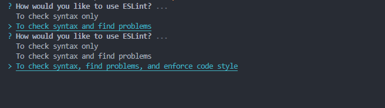

---
## 代码规范

### 一、bash集合概览

```bash
# 添加格式化工具Prettier
yarn add prettier -D
# 添加Eslint
yarn add eslint -D
# 选择Eslint配置
npx eslint --init
# 解决Prettier和Eslint冲突
yarn add eslint-plugin-prettier eslint-config-prettier -D
# 安装husky
npx husky-init && yarn install
# 安装lint-staged
yarn add lint-staged -D
```

`package.json`的`script`中加入<code style='color:red;'>"preinstall": "npx only-allow yarn"</code>指定**yarn**为唯一包管理器

[新建`.editorconfig`](#editorconfig)
[新建`.prettierrc`](#prettierrc)

------

下面我们介绍一套规范组合以及相关的配置（`EditorConfig + Prettier + ESlint`）

-   解决团队之间代码不规范导致的可读性差、可维护性差的问题
-   解决团队成员使用不同编辑器导致代码规范不统一的问题
-   提前发下代码风格问题，给出相应提示，及时修复
-   减少代码审查过程中反反复复的修改，节约时间
-   自动格式化，统一代码风格

### 二、集成 `EditorConfig `配置

EditorConfig 有助于为不同 IDE 编辑器上处理同一项目的多个开发人员维护一致的代码风格。

官网：[editorconfig.org](https://editorconfig.org/)

<a id='editorconfig'>在项目的根目录下创建 `.editorconfig` 文件：</a>


```bash
# Editor configuration, see http://editorconfig.org

# 表示是最顶层的 EditorConfig 配置文件
root = true

[*] # 表示所有文件适用
charset = utf-8 # 设置文件字符集为 utf-8
indent_style = space # 缩进风格（tab | space）
indent_size = 2 # 缩进大小
end_of_line = lf # 控制换行类型(lf | cr | crlf)
trim_trailing_whitespace = true # 去除行首的任意空白字符
insert_final_newline = true # 始终在文件末尾插入一个新行

[*.md] # 表示仅 md 文件适用以下规则
max_line_length = off
trim_trailing_whitespace = false

[{*.ng,*.sht,*.html,*.shtm,*.shtml,*.htm}]
indent_style=space
indent_size=2

[{*.jhm,*.xslt,*.xul,*.rng,*.xsl,*.xsd,*.ant,*.tld,*.fxml,*.jrxml,*.xml,*.jnlp,*.wsdl}]
indent_style=space
indent_size=2

[{.babelrc,.stylelintrc,jest.config,.eslintrc,.prettierrc,*.json,*.jsb3,*.jsb2,*.bowerrc}]
indent_style=space
indent_size=2

[*.svg]
indent_style=space
indent_size=2

[*.js.map]
indent_style=space
indent_size=2

[*.less]
indent_style=space
indent_size=2

[*.vue]
indent_style=space
indent_size=2

[{.analysis_options,*.yml,*.yaml}]
indent_style=space
indent_size=2
```

注意：

- VSCode 使用 EditorConfig 需要去插件市场下载插件 `EditorConfig VS Code`

  

-   JetBrains 系列 （WebStorm、IntelliJ IDEA）则不用额外安装插件，可直接使用 EditorConfig 配置。

### 三、集成 Prettier 配置

Prettier 是一款强大的代码格式化工具，支持JavaScript、Typescript、Css、Scss、Less、JSX、Angular、Vue、GraphQL、JSON、Markdown等，基本上前端能用到的文件格式都可以搞定，是当下最流行的格式化工具。

官网：[prettier.io/](https://prettier.io/)

1.  安装Prettier
    
    ```bash
    yarn add prettier -D
    ```
    
    
    
2.  创建 Prettier 配置文件
    
    Prettier 支持多种格式的配置文件，比如 .json、.yml、yaml、.js等。 在根目录下创建 .prettierrc 文件
    
3. 配置 `.prettierrc` 在本项目中，我们进行如下简单配置，关于更多的配置项信息，[查阅官网](https://prettier.io/docs/en/configuration.html)

<a id='prettierrc'>新建`.prettierrc`</a>

```bash
{
  "useTabs": false,
  "tabWidth": 2,
  "printWidth": 100,
  "singleQuote": true,
  "trailingComma": "none",
  "bracketSpacing": true,
  "semi": true
}
```

4.  Prettier安装配置好之后，就能使用命令来格式化代码

```bash
# 格式化所有文件 （. 表示所有文件）
npx prettier --write .
```

注意：

- VSCode 编辑器使用 Prettier 配置需要下载插件 Prettier - Code formatter

   

-   JetBrains 系列 （WebStorm、IntelliJ IDEA）则不用额外安装插件，可直接使用 EditorConfig 配置。

Prettier 配置好以后，在使用 VSCode 或 WebStorm 等编辑器的格式化功能时，编辑器就会按照 Prettier 配置文件的规则来进行格式化，避免了因为大家编辑器配置不一样而导致格式化后的代码风格不统一的问题。

### 四、集成 ESlint 配置

ESLint 是一款用于查找并报告代码中问题的工具，并且支持部分问题自动修复。其核心是通过对代码解析得到的 AST（Abstract Syntax Tree 抽象语法树）进行模式匹配，来分析代码达到检查代码质量和风格问题的能力。

正如前面我们提到的因团队成员之间编程能力和编码习惯不同所造成的代码质量问题，我们使用 ESLint 来解决，一边写代码一边查找问题，如果发现错误，就给出规则提示，并且自动修复，长期下去，可以促使团队成员往同一种编码风格靠拢。

1.  ##### 安装 ESLint
    
    可以全局或者本地安装，推荐本地安装（只在当前项目中安装）。
    
    ```bash
    yarn add eslint -D
    ```
    
    
    
2.  ###### 配置ESLint
    
    ESLint 安装成功后，执行 `npx eslint --init`，然后按照终端操作提示完成一系列设置来创建配置文件。
    
    | 插件 |
    | --- |
    | [`Airbnb JavaScript Style Guide`](https://github.com/airbnb/javascript) |
    | [`JavaScript Standard Style`](https://github.com/standard/standard) |
    | [`Google JavaScript Style Guide`](https://goole.github.io/styleguide/jsguide.html) |
    

操作：

- How would you like to use ESLint? （你想如何使用 ESLint?）

  > 我们这里选择 To check syntax, find problems, and enforce code style（检查语法、发现问题并强制执行代码风格）

- What type of modules does your project use?（你的项目使用哪种类型的模块?）

  > 我们这里选择 JavaScript modules (import/export)

- Which framework does your project use? （你的项目使用哪种框架?）

  ​	

  > 我们这里选择 Vue.js

-   Does your project use TypeScript?（你的项目是否使用 TypeScript？）

  > 我们这里选择 Yes（新项目）

- Where does your code run?（你的代码在哪里运行?）

  > 我们这里选择 Browser 和 Node（按空格键进行选择，选完按回车键确定）

- How would you like to define a style for your project?（你想怎样为你的项目定义风格？）

  > 我们这里选择 Use a popular style guide（使用一种流行的风格指南）

- Which style guide do you want to follow?（你想遵循哪一种风格指南?）

  > 我们这里选择 Airbnb: [github.com/airbnb/java…](https://github.com/airbnb/javascript)
  >
  > ESLint 为我们列出了三种社区流行的 JavaScript 风格指南，分别是 Airbnb、Standard、Google。我们选用 GitHub 上 star 最多的 Airbnb，免去繁琐的配置 ESLint 规则时间。此时，我们在 ESLint 配置了 Airbnb JavaScript 规则，在编码时，所有不符合 Airbnb 风格的代码，编辑器都会给出提示，并且可以自动修复。
  >

**注意：如果自动安装依赖失败，那么需要手动安装**

```bash
yarn add @typescript-eslint/eslint-plugin @typescript-eslint/parser eslint-config-airbnb-base eslint-plugin-import eslint-plugin-vue -D
```

3.  ###### ESlint 配置文件 `.eslintrc.js` 在上一步操作完成后，会在项目根目录下自动生成 .eslintrc.js 配置文件：

```js
module.exports = {
  env: {
    browser: true,
    es2021: true,
    node: true,
  },
  extends: ["plugin:vue/essential", "airbnb-base"],
  parserOptions: {
    ecmaVersion: 12,
    parser: "@typescript-eslint/parser",
    sourceType: "module",
  },
  plugins: ["vue", "@typescript-eslint"],
  rules: {},
};
```

根据项目实际情况，如果我们有额外的 ESLint 规则，也在此文件中追加。

注意：

-   VSCode 使用 ESLint 配置文件需要去插件市场下载插件 ESLint 。


-   JetBrains 系列（WebStorm、IntelliJ IDEA 等）则不用额外安装插件。 配置好以后，我们在 VSCode 或 WebStorm 等编辑器中开启 ESLint，写代码时，ESLint 就会按照我们配置的规则来进行实时代码检查，发现问题会给出对应错误提示和修复方案。

虽然，现在编辑器已经给出错误提示和修复方案，但需要我们一个一个去点击修复，还是挺麻烦的。很简单，我们只需设置编辑器保存文件时自动执行 eslint --fix 命令进行代码风格修复。

-   VSCode 在 settings.json 设置文件中，增加以下代码：

```
"editor.codeActionsOnSave": {
    "source.fixAll.eslint": true
 }
```

-   WebStorm 打开设置窗口，按如下操作，最后点击 Apply -> OK。


#### 1.解决 Prettier 和 ESLint 的冲突

项目中的 ESLint 配置中使用了 Airbnb JavaScript 风格指南校验，其规则之一是代码结束后面要加分号，而我们在 Prettier 配置文件中加了代码结束后面不加分号的配置项，这样就有冲突了，会出现用 Prettier 格式化后的代码，ESLint 检测到格式有问题的，从而抛出错误提示。 解决两者冲突问题，需要用到 `eslint-plugin-prettier` 和 `eslint-config-prettier`。

-   `eslint-plugin-prettier` 将 Prettier 的规则设置到 ESLint 的规则中。
-   `eslint-config-prettier` 关闭 ESLint 中与 Prettier 中会发生冲突的规则。 最后形成优先级：Prettier 配置规则 > ESLint 配置规则。
-   安装插件

```bash
yarn add eslint-plugin-prettier eslint-config-prettier -D
```

-   在 `.eslintrc.js` 添加 prettier 插件

```bash
module.exports = {
  ...
  extends: [
    'plugin:vue/essential',
    'airbnb-base',
    'plugin:prettier/recommended' // 添加 prettier 插件
  ],
  ...
}
```


这样，我们在执行 eslint --fix 命令时，ESLint 就会按照 Prettier 的配置规则来格式化代码，轻松解决二者冲突问题。

集成 husky 和 lint-staged

我们在项目中已集成 ESLint 和 Prettier，在编码时，这些工具可以对我们写的代码进行实时校验，在一定程度上能有效规范我们写的代码，但团队可能会有些同学觉得这些条条框框的限制很麻烦，选择视“提示”而不见，依旧按自己的一套风格来写代码，或者干脆禁用掉这些工具，开发完成就直接把代码提交到了仓库，日积月累，ESLint 也就形同虚设。

所以，我们还需要做一些限制，让没通过 ESLint 检测和修复的代码禁止提交，从而保证仓库代码都是符合规范的。

为了解决这个问题，我们需要用到 Git Hook，在本地执行 git commit 的时候，就对所提交的代码进行 ESLint 检测和修复（即执行 eslint --fix），如果这些代码没通过 ESLint 规则校验，则禁止提交。

实现这一功能，我们借助 `husky + lint-staged` 。

> husky —— Git Hook 工具，可以设置在 git 各个阶段（pre-commit、commit-msg、pre-push 等）触发我们的命令。

> lint-staged —— 在 git 暂存的文件上运行 linters。

#### 2.配置 husky

-   自动配置（推荐） 使用 husky-init 命令快速在项目初始化一个 husky 配置。

```bash
npx husky-init && yarn install
```


这行命令做了四件事：

1.  安装 `husky` 到开发依赖
2.  在项目根目录下创建 `.husky` 目录
3.  在 `.husky` 目录创建 `pre-commit hook`，并初始化 `pre-commit` 命令为 `npm test`

4. 修改 `package.json` 的 scripts，增加 `"prepare": "husky install"`

 到这里，husky 配置完毕，现在我们来使用它：

`husky` 包含很多 hook（钩子），常用有：`pre-commit、commit-msg、pre-push`。这里，我们使用 `pre-commit` 来触发 ESLint 命令。

修改 `.husky/pre-commit` hook 文件的触发命令：

```bash
eslint --fix ./src --ext .vue,.js,.ts
```

上面这个 `pre-commit` hook 文件的作用是：当我们执行 `git commit -m "xxx"` 时，会先对 `src` 目录下所有的 `.vue、.js、.ts` 文件执行 `eslint --fix` 命令，如果 `ESLint` 通过，成功 `commit`，否则终止 `commit`。

但是又存在一个问题：有时候我们明明只改动了一两个文件，却要对所有的文件执行 `eslint --fix`。假如这是一个历史项目，我们在中途配置了 ESLint 规则，那么在提交代码时，也会对其他未修改的“历史”文件都进行检查，可能会造成大量文件出现 ESLint 错误，显然不是我们想要的结果。

我们要做到只用 ESLint 修复自己此次写的代码，而不去影响其他的代码。所以我们还需借助一个工具 lint-staged 。

#### 3.配置 lint-staged

`lint-staged` 这个工具一般结合 `husky `来使用，它可以让 `husky `的 hook 触发的命令只作用于 `git add` 那些文件（即 git 暂存区的文件），而不会影响到其他文件。

接下来，我们使用 `lint-staged` 继续优化项目。

1.  安装 lint-staged

```bash
yarn add lint-staged -D
```

2.  在 `package.json`里增加 `lint-staged` 配置项

```bash
"lint-staged": {
  "*.{vue,js,ts}": "eslint --fix"
},
```

这行命令表示：只对 git 暂存区的 .vue、.js、.ts 文件执行 eslint --fix。

3. 修改 `.husky/pre-commit` hook 的触发命令为：`npx lint-staged`

    至此，husky 和 lint-staged 组合配置完成。

提交代码时，如果 ESLint 通过，成功提交，否则终止提交。从而保证了我们提交到 Git 仓库的代码都是规范的。

### 五、vscode配置

```bash
"editor.codeActionsOnSave": {
    "source.fixAll.eslint": true
},
```
