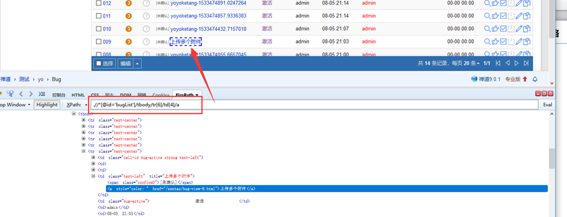
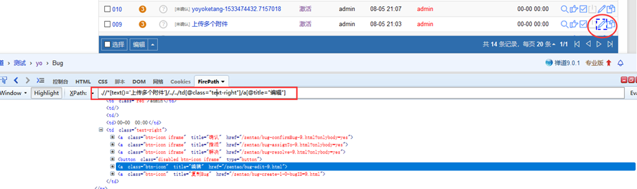

---
# Xpath

**火狐，谷歌浏览器调试可在console栏输入`$x("some xpath function here")`进行xpath元素查找**


## 1.Xpath中绝对路径和相对路径的区别

### 1.1、如果元素的 ID 不唯一，或者是动态的，或者 name 以及 linktext 属性值也不唯一， 对于这样的元素，我们就需要考虑用 xpath 来查找元素了，然后再对元素执行操作。 

### 1.2、不管用什么方式查找元素，id、Name、Xpath、css—>都需要在页面上查找到唯一的元素。 都应该只找到一个匹配的 node（节点），除非想要查找一批元素放集合里，然后来操作集合。

### 1.3、单右斜线“/”和双右斜线“//”的区别:

单右斜线“/”,在 XPATH 里面任何地方的单右斜代表要查找的元素是挨着上一级节点的子节点中的一个，中间不能跳级。

双右斜线“//”，代表查找下级任何子节点或者任何嵌套子节点中的一个，可以跳级。（模糊查询）

### 1.4、语法

```js
tag[@attribute='value']

//查找下级任何子节点

tag：标签

attribute：属性

valuse：属性值
```

## 2.XPath匹配含有指定文本的标签——**contains**的用法

- `starts-with(@someArr,'value') `:顾名思义，匹配一个属性开始位置的关键字
- `text（）` 匹配的是显示文本信息

### 2.1 实例

例：

```js
input[contains(@name,'na')] 
//查找name属性中包含na关键字的页面元素
```


```js
xpath('//div[contains(@class,"a") and contains(@class,"b")]') 
//它会取class含有a和b的元素 a && b
```

```js
xpath('//div[contains(@class,"a") or contains(@class,"b")]') 
//它会取class 含有 a 或者 b满足时，或者同时满足时的元素 a | b | (a && b)
```


### 2.2 标签中只包含文字

```html
<div>
  <ul id="side-menu">
    <li class="active">
      <a href="#">
      卷期号：
      </a>
    </li>
  </ul>
</div>
```

取包含 '卷期号' 三个字的节点 

```code
//ul[@id='side-menu']/li/a[contains(text(),"卷期号")]`
```


取其内容   

```code
//ul[@id='side-menu']/li/a[contains(text(), '卷期号')]/text()
```


### 2.3 文字没有被一个明确的标签包裹

```html
<div>
  <ul id="side-menu">
    <li class="active">
      <a href="#">
        <i>DOI</i>
        卷期号：
        <span>xxxx</span>
      </a>
    </li>
  </ul>
</div>
```

**再用上边的xpath表达式就到不到了, 不过可以借助string()， 将a标签里边的东西全部转换成字符串, 再用contains判断** 

```code
//ul[@id='side-menu']/li/a[contains(string(), '卷期号')]/text()
```


## 3. Xpath定位

### 3.1 常规属性

1. id定位

```js
"//*[@id='kw']" 
// *匹配所有元素
```

tag（标签）定位

```js
"//input[@id='kw']"
//id为kw的input框
```


class定位

```js
"//input[@class='s_ipt']"
//class为s_ipt的input框
```


name定位

```js
"//input[@name='wd']"
```


其他属性

```js
"//input[@autocomplete='off']"
//autocomplete属性为off的input
```

## 4.Table定位

### 4.1 定位表格



Table表格固定格式：`.//*[@id=‘表格id’]/tbody/tr[行数]/td[列数]/a`

```js
".//*[@id='bugList']/tbody/tr[6]/td[4]/a"
```

### 4.2 参数化行和列

```js
const x = 6
const y = 4
table = `.//*[@id='bugList']/tbody/tr[${x}]/td[${y}]/a`
```

*puppeteer*: 

`page.xpath( table )`

### 4.3 根据表格标题定位后面的按钮



1. 先通过bug的标题名称找到这一行
2. 再找到这一行的父节点
3. 通过父节点往下搜（编辑按钮都是固定位置）

```js
const text = "上传多个附件"
xpath = `.//*[text()="${text}"]/../../td[@class="text-right"]/a[@title="编辑"]`
```

