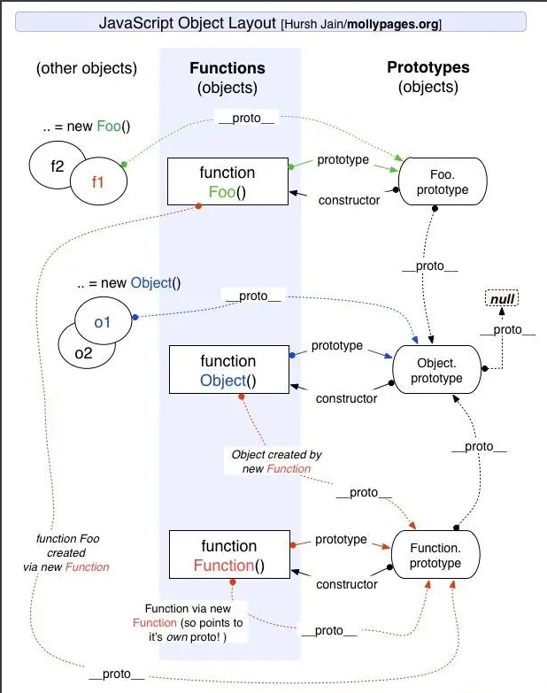

---

# 前端的一些整理

## 1、JS 原型及原型链

```javascript
function Person() {}
Person.prototype.name = 'Zaxlct';
Person.prototype.sayName = function() {
  alert(this.name);
}
var person1 = new Person();
//JS 在创建对象的时候，都有一个__proto__ 的内置属性，用于指向创建它的构造函数的原型对象。
//每个对象都有 __proto__ 属性，但只有函数对象才有 prototype 属性
// 对象 person1 有一个 __proto__属性，创建它的构造函数是 Person，构造函数的原型对象是 Person.prototype
console.log(person1.__proto__ == Person.prototype) //true
//所有函数对象的__proto__都指向Function.prototype
String.__proto__ === Function.prototype  // true
String.constructor == Function //true
```



## 2、JS 继承的几种方式

详解

1. 原型继承

```js
function Parent () {
  this.name = 'Parent'
  this.sex = 'boy'
}
function Child () {
  this.name = 'child'
}
// 将子类的原型对象指向父类的实例
Child.prototype = new Parent()
//优：继承了父类的模板，又继承了父类的原型对象
//缺：1.无法实现多继承(因为已经指定了原型对象了)
//   2.创建子类时，无法向父类构造函数传参数
```

2. 构造函数继承

在子类构造函数内部使用`call或apply`来调用父类构造函数，复制父类的实例属性给子类。

```js
function Parent (name) {
  this.name = name
}
function Child () {
  //用.call 来改变 Parent 构造函数内的指向
  Parent.call(this, 'child')
}
//优：解决了原型链继承中子类实例共享父类引用对象的问题，实现多继承，创建子类实例时，可以向父类传递参数
//缺：构造继承只能继承父类的实例属性和方法，不能继承父类原型的属性和方法
```

3. 组合继承

    组合继承就是将原型链继承与构造函数继承组合在一起。

- 使用**原型链继承**来保证子类能继承到父类原型中的属性和方法
- 使用**构造继承**来保证子类能继承到父类的实例属性和方法

5. 寄生组合继承
6. class 继承

在`class`  中继承主要是依靠两个东西：

- `extends`
- `super`

```js
class Parent {
  constructor (name) {
    this.name = name
  }
  getName () {
    console.log(this.name)
  }
}
class Child extends Parent {
  constructor (name) {
    super(name)
    this.sex = 'boy'
  }
}
```

## 3、Event Loop 事件循环

> 同步与异步、宏任务和微任务分别是函数两个不同维度的描述。

同步任务指的是，在主线程上排队执行的任务，只有前一个任务执行完毕，才能执行后一个任务；**异步任务**指的是，不进入主线程、而进入**任务队列**（`task queue`）的任务，只有等主线程任务执行完毕，任务队列开始通知主线程，请求执行任务，该任务才会进入主线程执行。

当某个宏任务执行完后,会查看是否有微任务队列。如果有，先执行微任务队列中的所有任务；如果没有，在执行环境栈中会读取宏任务队列中排在最前的任务；执行宏任务的过程中，遇到微任务，依次加入微任务队列。栈空后，再次读取微任务队列里的任务，依次类推。

> 同步（Promise）>异步（微任务（process.nextTick ，Promises.then, Promise.catch ，resove,reject,MutationObserver)>宏任务（setTimeout，setInterval，setImmediate））

**await 阻塞**  后面的代码执行，因此**跳出 async 函数**执行下一个微任务

## 4、Promise 与  **Async/Await**   区别

async/await 是基于 Promise 实现的，看起来更像同步代码，

- 不需要写匿名函数处理 Promise 的 resolve 值
- **错误处理**：　 Async/Await 让 try/catch 可以同时处理同步和异步错误。
- 条件语句也跟错误处理一样简洁一点
- 中间值处理（第一个方法返回值，用作第二个方法参数） 解决嵌套问题
- 调试方便

```javascript
const makeRequest = () => {
    try {
        getJSON().then(result => {
            // JSON.parse可能会出错
            const data = JSON.parse(result)
            console.log(data)
        })
        // 取消注释，处理异步代码的错误
        // .catch((err) => {
        //   console.log(err)
        // })
    } catch (err) {
        console.log(err)
    }
}
```

使用`aync/await`的话，catch 能处理`JSON.parse`错误:

```js
const makeRequest = async () => {
    try {
        // this parse may fail
        const data = JSON.parse(await getJSON())
        console.log(data)
    } catch (err) {
        console.log(err)
    }
}
```

## 5、promise 怎么实现链式调用跟返回不同的状态

实现链式调用：使用`.then()`或者`.catch()`方法之后会返回一个`promise`对象，可以继续用`.then()`方法调用，再次调用所获取的参数是上个`then`方法`return`的内容

1. promise 的三种状态是  `fulfilled`(已成功)/`pengding`(进行中)/`rejected`(已拒绝)
2. 状态只能由 Pending --> Fulfilled 或者 Pending --> Rejected，且一但发生改变便不可二次修改；
3. Promise 中使用  `resolve`  和  `reject`  两个函数来更改状态；
4. then 方法内部做的事情就是状态判断:

- 如果状态是成功，调用成功回调函数
- 如果状态是失败，调用失败回调函数

## 6、函数柯里化

`柯里化(Currying)`  是把接收多个参数的原函数变换成接受一个单一参数（原来函数的第一个参数的函数)并返回一个新的函数，新的函数能够接受余下的参数，并返回和原函数相同的结果。

1. 参数对复用
2. 提高实用性
3. 延迟执行 只传递给函数一部分参数来调用它，让它返回一个函数去处理剩下的参数。柯里化的函数可以延迟接收参数，就是比如一个函数需要接收的参数是两个，执行的时候必须接收两个参数，否则没法执行。但是柯里化后的函数，可以先接收一个参数

```js
// 普通的add函数
function add(x, y) {
    return x + y
}

// Currying后
function curryingAdd(x) {
    return function (y) {
        return x + y
    }
}

add(1, 2)           // 3
curryingAdd(1)(2)   // 3
```

## 7、JS 对象深克隆

> 递归遍历对象，解决循环引用问题

解决循环引用问题，我们需要一个存储容器存放当前对象和拷贝对象的对应关系（适合用 key-value 的数据结构进行存储，也就是 map），当进行拷贝当前对象的时候，我们先查找存储容器是否已经拷贝过当前对象，如果已经拷贝过，那么直接把返回，没有的话则是继续拷贝。

```js
function deepClone(target) {
    const map = new Map()
    function clone (target) {
        if (isObject(target)) {
            let cloneTarget = isArray(target) ? [] : {};
            if (map.get(target)) {
                return map.get(target)
            }
            map.set(target,cloneTarget)
            for (const key in target) {
                cloneTarget[key] = clone(target[key]);
            }
            return cloneTarget;
        } else {
            return target;
        }
    }
    return clone(target)
};
```

## 8、JS 模块化

`nodeJS`里面的模块是基于`commonJS`规范实现的，原理是文件的读写，导出文件要使用`exports`、`module.exports`，引入文件用`require`。每个文件就是一个模块；每个文件里面的代码会用默认写在一个闭包函数里面`AMD`规范则是非同步加载模块，允许指定回调函数，`AMD`  是  `RequireJS`  在推广过程中对模块定义的规范化产出。

`AMD`推崇**依赖前置**, `CMD`推崇**依赖就近**。对于依赖的模块 AMD 是提前执行，CMD 是延迟执行。

在`ES6`中，我们可以使用  `import`  关键字引入模块，通过  `exprot`  关键字导出模块，但是由于 ES6 目前无法在浏览器中执行，所以，我们只能通过`babel`将不被支持的`import`编译为当前受到广泛支持的  `require`。

CommonJs 和 ES6 模块化的区别：

1. CommonJS 模块输出的是一个值的拷贝，ES6 模块输出的是值的引用。
2. CommonJS 模块是运行时加载，ES6 模块是编译时输出接口。

前端模块化：CommonJS,AMD,CMD,ES6

### import 和 require 导入的区别

import 的 ES6 标准模块；require 是 AMD 规范引入方式；

import 是编译时调用，所以必须放在文件开头;是解构过程 require 是运行时调用，所以 require 理论上可以运用在代码的任何地方;是赋值过程。其实 require 的结果就是对象、数字、字符串、函数等，再把 require 的结果赋值给某个变量

## 9、异步加载 JS 方式

1. 匿名函数自调动态创建 script 标签加载 js

```js
(function(){
    var scriptEle = document.createElement("script");
    scriptEle.type = "text/javasctipt";
    scriptEle.async = true;
    scriptEle.src = "http://cdn.bootcss.com/jquery/3.0.0-beta1/jquery.min.js";
    var x = document.getElementsByTagName("head")[0];
    x.insertBefore(scriptEle, x.firstChild);  
 })();
```

2. async 属性

```html
<!-- async属性规定一旦加载脚本可用，则会异步执行 -->
<script type="text/javascript" src="xxx.js" async="async"></script>
```

3. defer 属性

```html
<!-- defer属性规定是否对脚本执行进行延迟，直到页面加载为止 -->
<script type="text/javascript" src="xxx.js" defer="defer"></script>// defer属性规定是否对脚本执行进行延迟，直到页面加载为止<script type="text/javascript" src="xxx.js" defer="defer"></script>
```

## 10、Set、Map、WeakSet、WeakMap

**Set**对象可以存储**任何类型**的数据。值是唯一的，**没有重复**的值。

**Map**对象保存**键值对**，任意值都可以成为它的键或值。

**WeakSet**  结构与  **Set**  类似，也是不重复的值的集合 . **WeakMap**  对象是一组**键值对**的集合

不同：`WeakSet`  的成员只能是**对象**，而不能是其他类型的值。**WeakSet 不可遍历**。

`WeakMap`只接受**对象作为键名**（`null`除外），不接受其他类型的值作为键名。

`WeakMap`的键名所指向的对象，**不计入**垃圾回收机制。

## 11、call、apply

`call( this,a,b,c )`  在第一个参数之后的，后续所有参数就是传入该函数的值。`apply( this,[a,b,c] )`  只有两个参数，第一个是对象，第二个是数组，这个数组就是该函数的参数。

共同之处：都可以用来代替另一个对象调用一个方法，将一个函数的对象上下文从初始的上下文改变为由 thisObj 指定的新对象。

**所谓防抖，就是指触发事件后在 n 秒内函数只能执行一次\*\***所谓节流，就是指连续触发事件但是在 n 秒中只执行一次函数。\*\*

addEventListener 的第三个参数干嘛的，为 true 时捕获，false 时冒泡

`Object.prototype.toString.call()`  判断对象类型

```js
// new Set是实现数组去重，
// Array.from()把去重之后转换成数组
let arr2 = Array.from(new Set(arr));

```

## 12、词法作用域与作用域链

作用域规定了如何查找变量，也就是确定当前执行代码对变量的访问权限。

> ES5 只有全局作用域没和函数作用域，ES6 增加块级作用域

暂时性死区：在代码块内，使用  **let**  和  **const**  命令声明变量之前，该变量都是不可用的，语法上被称为暂时性死区。

JavaScript 采用词法作用域(lexical scoping)，也就是静态作用域。

**函数的作用域在函数定义的时候就决定了。**

当查找变量的时候，会先从当前上下文的变量对象中查找，如果没有找到，就会从父级(词法层面上的父级**执行上下文**的变量对象中查找，一直找到全局上下文的变量对象，也就是全局对象。这样由多个执行上下文的变量对象构成的链表就叫做**作用域链**。

## 13、new 关键字做了 4 件事

```js
function _new(constructor, ...arg) {
// 创建一个空对象
  var obj = {};
  // 空对象的`__proto__`指向构造函数的`prototype`, 为这个新对象添加属性 
  obj.__proto__ = constructor.prototype; 
  // 构造函数的作用域赋给新对象
  var res = constructor.apply(obj, arg); 
  // 返回新对象.如果没有显式return语句，则返回this
  return Object.prototype.toString.call(res) === '[object Object]' ? res : obj; 
}
```

## 14、不应该使用箭头函数一些情况

- 当想要函数被提升时(箭头函数是匿名的)
- 要在函数中使用`this/arguments`时，由于箭头函数本身不具有`this/arguments`，因此它们取决于外部上下文
- 使用命名函数(箭头函数是匿名的)
- 使用函数作为构造函数时(箭头函数**没有构造函数**)
- 当想在对象字面是以将函数作为**属性**添加并在其中使用对象时，因为咱们无法访问  `this`  即对象本身。

## 15、判断数组的四种方法

1. **Array.isArray()**  判断
2. **instanceof**  判断: 检验构造函数的 prototype 属性是否出现在对象的原型链中，返回一个布尔值。`let a = []; a instanceof Array; //true`
3. **constructor**判断: 实例的构造函数属性 constructor 指向构造函数`let a = [1,3,4]; a.constructor === Array;//true`
4. **Object.prototype.toString.call()**  判断`let a = [1,2,3]; Object.prototype.toString.call(a) === '[object Array]';//true`

## 16、TS 有什么优势

1. 静态输入：静态类型化是一种功能，可以在开发人员编写脚本时检测错误。
2. 大型的开发项目：使用 TypeScript 工具来进行重构更变的容易、快捷。
3. 更好的协作：类型安全是在编码期间检测错误，而不是在编译项目时检测错误。
4. 更强的生产力：干净的 ECMAScript 6 代码，自动完成和动态输入等因素有助于提高开发人员的工作效率。

### interface 和 type 的区别

- interface 只能定义对象类型。type 声明可以声明任何类型。
- interface 能够声明合并，两个相同接口会合并。Type 声明合并会报错
- type 可以类型推导

## 17、Vue3.0 新特性

### 双向数据绑定 Proxy

代理,可以理解为在对象之前设置一个“拦截”，当该对象被访问的时候，都必须经过这层拦截。意味着你可以在这层拦截中进行各种操作。比如你可以在这层拦截中对原对象进行处理，返回你想返回的数据结构。

ES6 原生提供 Proxy 构造函数，MDN 上的解释为：Proxy 对象用于定义基本操作的自定义行为（如属性查找，赋值，枚举，函数调用等）。

```js
const p = new Proxy(target, handler);
//target： 所要拦截的目标对象（可以是任何类型的对象，包括原生数组，函数，甚至另一个代理）
//handler：一个对象，定义要拦截的行为

const p = new Proxy({}, {
    get(target, propKey) {
        return '哈哈，你被我拦截了';
    }
});

console.log(p.name);
```

新增的属性，并不需要重新添加响应式处理，因为 Proxy 是对对象的操作，只要你访问对象，就会走到 Proxy 的逻辑中。

### Vue3 Composition API

`Vue3.x`  推出了`Composition API`。`setup`  是组件内使用 Composition API 的入口。`setup`  执行时机是在  `beforeCreate`  之前执行.

#### reactive、ref 与 toRefs、isRef

Vue3.x 可以使用 reactive 和 ref 来进行数据定义。

```js
// props 传入组件对属性
// context 一个上下文对象,包含了一些有用的属性:attrs,parent,refs
setup(props, context) {
  // ref 定义数据
  const year = ref(0);
  // reactive 处理对象的双向绑定
  const user = reactive({ nickname: "xiaofan", age: 26, gender: "女" });
  setInterval(() => {
    year.value++;
    user.age++;
  }, 1000);
  return {
    year,
    // 使用toRefs,结构解构
    ...toRefs(user),
  };
},
// 提供isRef，用于检查一个对象是否是ref对象
```

#### watchEffect 监听函数

- watchEffect 不需要手动传入依赖
- watchEffect 会先执行一次用来自动收集依赖
- watchEffect 无法获取到变化前的值， 只能获取变化后的值

#### computed 可传入 get 和 set

用于定义可更改的计算属性

```js
const plusOne = computed({
 get: () => count.value + 1,
 set: val => { count.value = val - 1 }
});
```

### 使用 TypeScript 和 JSX

`setup`现在支持返回一个渲染函数，这个函数返回一个`JSX`，`JSX`可以直接使用声明在`setup`作用域的响应式状态：

```js
export default {
 setup() {
 const count = ref(0);
 return () => (<div>{count.value}</div>);
 },
};
```

## 18、vue-router 实现原理

端路由简介以及 vue-router 实现原理原理核心就是 更新视图但不重新请求页面。路径之间的切换，也就是组件的切换。vue-router 实现单页面路由跳转模式：hash 模式、history 模式。根据设置 mode 参数

`hash模式`：通过锚点值的改变，根据不同的值，渲染指定 DOM 位置的不同数据。每一次改变`#`后的部分，都会在浏览器的访问历史中增加一个记录，使用”后退”按钮，就可以回到上一个位置。`history模式`：利用  `window.history.pushState` API 来完成 URL 跳转而无须重新加载页面。

## 19、vuex 实现原理

`Vue.use(vuex)`会调用 vuex 的 install 方法

在`beforeCreate`钩子前混入`vuexInit`方法，`vuexInit`方法实现了`store`注入`vue组件实例`，并注册了`vuex` `store`的引用属性`$store`。

`Vuex`的`state`状态是响应式，是借助`vue`的`data`是响应式，将`state`存入 vue 实例组件的 data 中；

`Vuex`的`getters`则是借助 vue 的计算属性`computed`实现数据实时监听。

## 20、nextTick 的原理以及运行机制？

nextTick 的源码分析

vue 进行 DOM 更新内部也是调用 nextTick 来做异步队列控制。只要观察到数据变化，Vue 将开启一个队列，并缓冲在同一事件循环中发生的所有数据改变。如果同一个 watcher 被多次触发，只会被推入到队列中一次。

DOM 至少会在当前事件循环里面的所有数据变化完成之后，再统一更新视图。而当我们自己**调用 nextTick 的时候**，它就在更新 DOM 的 microtask(微任务队列)后**追加了我们自己的回调函数**，

从而确保我们的代码在 DOM 更新后执行，同时也避免了 setTimeout 可能存在的多次执行问题。确保队列中的微任务在一次事件循环前被执行完毕。

## 21、Vue 父组件传递 props 数据，子组件修改参数

- 父子组件传值时，父组件传递的参数，数组和对象，子组件接受之后可以直接进行修改，并且父组件相应的值也会修改。控制台中发出警告。
- 如果传递的值是字符串，直接修改会报错。单向数据流，每次父级组件发生更新时，子组件中所有的 prop 都将会刷新为最新的值。

如果子组件想修改 prop 中数据：

1. 定义一个局部变量，使用 prop 的值赋值
2. 定义一个计算属性，处理 prop 的值并返回

## 22 、Vue 父子组件生命周期执行顺序

加载渲染过程

> 父 beforeCreate -> 父 created -> 父 beforeMount-> 子 beforeCreate -> 子 created -> 子 beforeMount -> 子 mounted -> 父 mounted

子组件更新过程

> 父 beforeUpdate -> 子 beforeUpdate -> 子 updated -> 父 updated

父组件更新过程

> 父 beforeUpdate -> 父 updated

销毁过程

> 父 beforeDestroy -> 子 beforeDestroy -> 子 destroyed -> 父 destroyed

## 23 、Vue 自定义指令

自定义指令提供了几个钩子函数：`bind`：指令第一次绑定到元素时调用`inserted`：被绑定元素插入父节点时调用`update`：所在组件的 VNode 更新时调用

使用**slot**后可以在子组件内显示**插入的新标签**

## 24 、webpack 的生命周期，及钩子

**compiler**（整个生命周期 \[kəmˈpaɪlər\]） 钩子 https://webpack.docschina.org/api/compiler-hooks/**compilation**（编译 \[ˌkɑːmpɪˈleɪʃn\]） 钩子

`compiler`对象包含了 Webpack 环境所有的的配置信息。这个对象在启动 webpack 时被一次性建立，并配置好所有可操作的设置，包括 options，loader 和 plugin。当在 webpack 环境中应用一个插件时，插件将收到此 compiler 对象的引用。可以使用它来访问 webpack 的主环境。

`compilation`对象包含了当前的模块资源、编译生成资源、变化的文件等。当运行 webpack 开发环境中间件时，每当检测到一个文件变化，就会创建一个新的 compilation，从而生成一组新的编译资源。compilation 对象也提供了很多关键时机的回调，以供插件做自定义处理时选择使用。

`compiler`代表了整个`webpack`从启动到关闭的`生命周期`，而`compilation`  只是代表了一次新的`编译过程`

## 25、 webpack 编译过程

Webpack 的编译流程是一个串行的过程，从启动到结束会依次执行以下流程：

1. 初始化参数：从配置文件和 Shell 语句中读取与合并参数，得出最终的参数；
2. 开始编译：用上一步得到的参数初始化  `Compiler`  对象，加载所有配置的插件，执行对象的  `run`方法开始执行编译；
3. 确定入口：根据配置中的  `entry`  找出所有的入口文件；
4. 编译模块：从入口文件出发，调用所有配置的  `Loader`  对模块进行翻译，再找出该模块依赖的模块，再递归本步骤直到所有入口依赖的文件都经过了本步骤的处理；
5. 完成模块编译：在经过第 4 步使用  `Loader`  翻译完所有模块后，得到了每个模块被翻译后的最终内容以及它们之间的依赖关系；
6. 输出资源：根据入口和模块之间的依赖关系，组装成一个个包含多个模块的`Chunk`，再把每个  `Chunk`  转换成一个单独的文件加入到输出列表，这步是可以修改输出内容的最后机会；
7. 输出完成：在确定好输出内容后，根据配置确定输出的路径和文件名，把文件内容写入到文件系统。

## 26 、 优化项目的 webpack 打包编译过程

**1.构建打点**：构建过程中，每一个`Loader`  和  `Plugin`  的执行时长，在编译 JS、CSS 的 Loader 以及对这两类代码执行压缩操作的 Plugin 上消耗时长 。一款工具：speed-measure-webpack-plugin

**2.缓存**：大部分 Loader 都提供了`cache`  配置项。`cache-loader` ，将 loader 的编译结果写入硬盘缓存

**3.多核编译**，`happypack`项目接入多核编译，理解为`happypack`  将编译工作灌满所有线程

**4.抽离**，`webpack-dll-plugin`  将这些静态依赖从每一次的构建逻辑中抽离出去，静态依赖单独打包，`Externals`将不需要打包的静态资源从构建逻辑中剔除出去，使用`CDN 引用`

**5.`tree-shaking`**，虽然依赖了某个模块，但其实只使用其中的某些功能。通过  `tree-shaking`，将没有使用的模块剔除，来达到删除无用代码的目的。

### 26 - 1首屏加载优化

- **路由懒加载**：改为用`import`引用，以函数的形式动态引入，可以把各自的路由文件分别打包，只有在解析给定的路由时，才会下载路由组件；

- **`element-ui`按需加载**：引用实际上用到的组件 ；

- **组件重复打包**：`CommonsChunkPlugin`配置来拆包，把使用 2 次及以上的包抽离出来，放进公共依赖文件，首页也有复用的组件，也会下载这个公共依赖文件；

- **gzip**: 拆完包之后，再用`gzip`做一下压缩，关闭 sourcemap。

- **UglifyJsPlugin:**   生产环境，压缩混淆代码，移除 console 代码

- CDN 部署静态资源：静态请求打在 nginx 时，将获取静态资源的地址进行重定向 CDN 内容分发网络

- **移动端首屏**加载可以使用**骨架屏**，自定义**loading**，首页单独做**服务端渲染**。

如何进行前端性能优化(21 种优化+7 种定位方式)

## 27、webpack 热更新机制

热更新流程总结:

- 启动本地`server`，让浏览器可以请求本地的**静态资源**
- 页面首次打开后，服务端与客户端通过 websocket 建立通信渠道，把下一次的 hash 返回前端
- 客户端获取到 hash，这个 hash 将作为下一次请求服务端 hot-update.js 和 hot-update.json 的 hash
- 修改页面代码后，Webpack 监听到文件修改后，开始编译，编译完成后，发送 build 消息给客户端
- 客户端获取到 hash，成功后客户端构造 hot-update.js script 链接，然后插入主文档
- hot-update.js 插入成功后，执行 hotAPI 的 createRecord 和 reload 方法，获取到 Vue 组件的 render 方法，重新 render 组件， 继而实现 UI 无刷新更新。

## 28 、webpack 的 loader 和 plugin 介绍，css-loader，style-loader 的区别

**loader**  它就是一个转换器，将 A 文件进行编译形成 B 文件，

**plugin** ，它就是一个扩展器，来操作的是文件，针对是 loader 结束后，webpack 打包的整个过程，它并不直接操作文件，会监听 webpack 打包过程中的某些节点（run, build-module, program）

**Babel**  能把 ES6/ES7 的代码转化成指定浏览器能支持的代码。

`css-loader`  的作用是把 css 文件进行转码`style-loader`: 使用`<style>`将`css-loader`内部样式注入到我们的 HTML 页面

先使用  `css-loader`转码，然后再使用  `style-loader`插入到文件

## 29、性能监控 && 性能优化

性能指标：

- `FP`（首次绘制）
- `FCP`（首次内容绘制 First contentful paint）
- `LCP`（最大内容绘制时间 Largest contentful paint）
- `FPS`（每秒传输帧数）
- `TTI`（页面可交互时间 Time to Interactive）
- `HTTP`  请求响应时间
- `DNS`  解析时间
- `TCP`  连接时间

性能数据采集需要使用  `window.performance API`

> JS 库  `web-vitals`：`import {getLCP} from 'web-vitals'`;
>
> npm地址：[web-vitals](https://www.npmjs.com/package/web-vitals)

```
    // 重定向耗时    redirect: timing.redirectEnd - timing.redirectStart,    // DOM 渲染耗时    dom: timing.domComplete - timing.domLoading,    // 页面加载耗时    load: timing.loadEventEnd - timing.navigationStart,    // 页面卸载耗时    unload: timing.unloadEventEnd - timing.unloadEventStart,    // 请求耗时    request: timing.responseEnd - timing.requestStart,    // 获取性能信息时当前时间    time: new Date().getTime(),    // DNS查询耗时    domainLookupEnd - domainLookupStart // TCP链接耗时    connectEnd - connectStart // request请求耗时    responseEnd - responseStart // 解析dom树耗时    domComplete - domInteractive // 白屏时间    domloadng - fetchStart // onload时间    loadEventEnd - fetchStart
```

性能优化常用手段：缓存技术、   预加载技术、   渲染方案。

1. **缓存** ：主要有 cdn、浏览器缓存、本地缓存以及应用离线包
2. **预加载** ：资源预拉取（prefetch）则是另一种性能优化的技术。通过预拉取可以告诉浏览器用户在未来可能用到哪些资源。

- prefetch 支持预拉取图片、脚本或者任何可以被浏览器缓存的资源。

    在 head 里 添加  `<linkrel="prefetch"href="image.png">`

- prerender 是一个重量级的选项，它可以让浏览器提前加载指定页面的所有资源。
- subresource 可以用来指定资源是最高优先级的。当前页面需要，或者马上就会用到时。

3. **渲染方案**：

- 静态渲染（SR）
- 前端渲染（CSR）
- 服务端渲染（SSR）
- 客户端渲染（NSR）：NSR 数据请求，首屏数据请求和数据线上与 webview 的一个初始化和框架 JS 初始化并行了起来，大大缩短了首屏时间。


640.png

## 30、常见的六种设计模式以及应用场景

<https://www.cnblogs.com/whu-2017/p/9471670.html>

### 观察者模式的概念

观察者模式模式，属于行为型模式的一种，它定义了一种一对多的依赖关系，**让多个观察者对象同时监听某一个主题对象**。这个主体对象在状态变化时，会通知所有的观察者对象。

### 发布订阅者模式的概念

发布-订阅模式，消息的发送方，叫做**发布者**（publishers），消息不会直接发送给特定的接收者，叫做**订阅者**。意思就是发布者和订阅者不知道对方的存在。需要一个第三方组件，叫做信息中介，它将订阅者和发布者串联起来，它过滤和分配所有输入的消息。换句话说，发布-订阅模式**用来处理不同系统组件的信息交流**，即使这些组件不知道对方的存在。

需要一个第三方组件，叫做**信息中介**，它将订阅者和发布者串联起来

**工厂模式**   主要是为创建对象提供了接口。场景：在编码时不能预见需要创建哪种类的实例。

**代理模式 命令模式**

### 单例模式

保证一个类仅有一个实例，并提供一个访问它的全局访问点。（window）

## 31、url 到加载渲染全过程

1. DNS 域名解析。
2. TCP 三次握手，建立接连。
3. 发送 HTTP 请求报文。
4. 服务器处理请求返回响应报文。
5. 浏览器解析渲染页面。
6. 四次挥手，断开连接。

**DNS 协议**提供通过`域名查找 IP地址`，或逆向从  `IP地址反查域名`的服务。DNS 是一个网络服务器，我们的域名解析简单来说就是在 DNS 上记录一条信息记录。

**TCP 三次握手，四次挥手**：握手挥手都是客户端发起，客户端结束。三次握手与四次挥手详解

**负载均衡**：请求在进入到真正的应用服务器前，可能还会先经过负责负载均衡的机器，它的作用是将请求`合理地分配到多个服务器上`，转发 HTTP 请求；同时具备具备防攻击等功能。可分为 DNS 负载均衡，HTTP 负载均衡，IP 负载均衡，链路层负载均衡等。

**Web Server**：请求经过前面的负载均衡后，将进入到对应服务器上的 Web Server，比如  `Apache`、`Tomcat`

**反向代理**是工作在 HTTP 上的，一般都是  `Nginx`。全国各地访问 baidu.com 就肯定要通过代理访问，不可能都访问百度的那台服务器。 （VPN 正向代理，代理客户端）

**浏览器解析渲染过程**：返回的 html 传递到浏览器后，如果有 gzip 会先解压，找出文件编码格式，外链资源的加载 html 从上往下解析，遇到 js，css 停止解析渲染，直到 js 执行完成。解析 HTML，构建 DOM 树 解析 CSS，生成 CSS 规则树 合并 DOM 树和 CSS 规则，生成 render 树去渲染

不会引起 DOM 树变化，页面布局变化，改变元素样式的行为叫**重绘**

引起 DOM 树结构变化，页面布局变化的行为叫**回流**

`GUI渲染线程`负责渲染浏览器界面 HTML 元素,当界面需要  `重绘(Repaint)`  或由于某种操作引发  `回流(reflow)`  时,该线程就会执行。**在 Javascript 引擎运行脚本期间,GUI 渲染线程都是处于挂起状态的,也就是说被”冻结”了. 直到 JS 程序执行完成**，才会接着执行。因此如果 JS 执行的时间过长，这样就会造成页面的渲染不连贯，导致页面渲染加载阻塞的感觉。JavaScript 是可操纵 DOM 的，如果在修改这些元素属性同时渲染界面，渲染前后元素数据可能不一致

GPU 绘制**多进程的浏览器**：主控进程，插件进程，GPU，tab 页（浏览器内核）**多线程的浏览器内核**：每一个 tab 页面可以看作是浏览器内核进程，然后这个进程是多线程的。

它有几大类子线程：

- GUI 线程
- JS 引擎线程
- 事件触发线程
- 定时器线程
- HTTP 请求线程

## 32、什么是 BFC（块级格式化上下文）、**IFC**（内联格式化上下文 ）、**FFC**（弹性盒模型）

`BFC（Block formatting context）`，即`块级格式化上下文`，它作为 HTML 页面上的一个`独立渲染区域`，只有区域内元素参与渲染，且不会影响其外部元素。简单来说，可以将 BFC 看做是一个“围城”，外面的元素进不来，里面的元素出不去（互不干扰）。

一个决定如何渲染元素的容器 ，渲染规则 ：

- 1、内部的块级元素会在垂直方向，一个接一个地放置。
- 2、块级元素垂直方向的距离由 margin 决定。属于同一个 BFC 的两个相邻块级元素的 margin 会发生重叠。
- 3、对于从左往右的格式化，每个元素（块级元素与行内元素）的左边缘，与包含块的左边缘相接触，(对于从右往左的格式化则相反)。即使包含块中的元素存在浮动也是如此，除非其中元素再生成一个 BFC。
- 4、BFC 的区域不会与浮动元素重叠。
- 5、BFC 是一个隔离的独立容器，容器里面的子元素和外面的元素互不影响。
- **6、计算 BFC 容器的高度时，浮动元素也参与计算。**

形成 BFC 的条件:

1、浮动元素，float 除 none 以外的值；

2、定位元素，position（absolute，fixed）；

3、display 为以下其中之一的值 inline-block，table-cell，table-caption；

4、overflow 除了 visible 以外的值（hidden，auto，scroll）；

BFC 一般用来解决以下几个问题

- 边距重叠问题
- 消除浮动问题
- 自适应布局问题

## 33、 `flex: 0 1 auto;`  是什么意思？

元素会根据自身宽高设置尺寸。它会缩短自身以适应  `flex`  容器，但不会伸长并吸收  `flex`  容器中的额外自由空间来适应  `flex`  容器  。水平的主轴（`main axis`）和垂直的交叉轴（`cross axis`）几个属性决定按哪个轴的排列方向

- `flex-grow`: `0`   一个无单位**数()**: 它会被当作`<flex-grow>的值。`
- `flex-shrink`: `1`   一个有效的``宽度(width)值``: 它会被当作  `<flex-basis>的值。`
- `flex-basis`: `auto`   关键字`none`，`auto`或`initial`.

放大比例、缩小比例、分配多余空间之前占据的主轴空间。

## 34、CSS布局

### CSS 两列布局的 N 种实现

> 两列布局分为两种，一种是左侧定宽、右侧自适应，另一种是两列都自适应（即左侧宽度由子元素决定，右侧补齐剩余空间）。

1. 左侧定宽、右侧自适应如何实现

```css
// 两个元素都设置dislpay:inline-block
.left {
    display: inline-block;
    width: 100px;
    height: 200px;
    background-color: red;
    vertical-align: top;
}
.right {
    display: inline-block;
    width: calc(100% - 100px);
    height: 400px;
    background-color: blue;
    vertical-align: top;
}
// 两个元素设置浮动，右侧自适应元素宽度使用calc函数计算
.left{
    float: left;
    width: 100px;
    height: 200px;
    background-color: red;
}
.right{
    float: left;
    width: calc(100% - 100px);
    height: 400px;
    background-color: blue;
}
// 父元素设置display：flex，自适应元素设置flex：1
.box{
    height: 600px;
    width: 100%;
    display: flex;
}
.left{
    width: 100px;
    height: 200px;
    background-color: red;
}
.right{
    flex: 1;
    height: 400px;
    background-color: blue;
}
// 父元素相对定位，左侧元素绝对定位，右侧自适应元素设置margin-left的值大于定宽元素的宽度
.left{
    position: absolute;
    width: 100px;
    height: 200px;
    background-color: red;
}
.right{
    margin-left: 100px;
    height: 400px;
    background-color: blue;
}
```

2. 左右两侧元素都自适应

```css
// flex布局 同上
// 父元素设置display：grid; grid-template-columns:auto 1fr;（这个属性定义列宽，auto关键字表示由浏览器自己决定长度。fr是一个相对尺寸单位，表示剩余空间做等分）grid-gap:20px（行间距）
.parent{
    display:grid;
    grid-template-columns:auto 1fr;
    grid-gap:20px
} 
.left{
    background-color: red;
    height: 200px;
}
.right{
    height:300px;
    background-color: blue;
}
// 浮动+BFC   父元素设置overflow:hidden,左侧定宽元素浮动，右侧自适应元素设置overflow:auto创建BFC
.box{
    height: 600px;
    width: 100%;
    overflow: hidden;
}
.left{
    float: left;
    width: 100px;
    height: 200px;
    background-color: red;
}
.right{
    overflow: auto;
    height: 400px;
    background-color: blue;
}
```

### CSS 三列布局

1. float 布局：左边左浮动，右边右浮动，中间 margin：0 100px;
2. Position 布局: 左边 left：0; 右边 right：0; 中间 left: 100px; right: 100px;
3. table 布局: 父元素 display: table; 左右 width: 100px; 三个元素 display: table-cell;
4. 弹性(flex)布局:父元素 display: flex; 左右 width: 100px;
5. 网格（gird）布局：

```css
// gird提供了 gird-template-columns、grid-template-rows属性让我们设置行和列的高、宽
.div{
    width: 100%;
    display: grid;
    grid-template-rows: 100px;
    grid-template-columns: 300px auto 300px;
}
```

## app 与 H5 如何通讯交互的？

```css
// 兼容IOS和安卓
callMobile(parameters,messageHandlerName) {
  //handlerInterface由iOS addScriptMessageHandler与andorid addJavascriptInterface 代码注入而来。
  if (/(iPhone|iPad|iPod|iOS)/i.test(navigator.userAgent)) {
    // alert('ios')
    window.webkit.messageHandlers[messageHandlerName].postMessage(JSON.stringify(parameters))
  } else {
    // alert('安卓')
    //安卓传输不了js json对象，只能传输string
    window.webkit[messageHandlerName](JSON.stringify(parameters))
  }
}
```

由 app 将原生方法注入到 window 上供 js 调用

`messageHandlerName`  约定的通信方法`parameters`  需要传入的参数

## 移动端适配方案

`rem`是相对于 HTML 的根元素`em`相对于父级元素的字体大小。`VW,VH`  屏幕宽度高度的高分比

```js
//按照宽度375图算， 1rem = 100px;
(function (win, doc) {
   function changeSize() {
     doc.documentElement.style.fontSize = doc.documentElement.clientWidth / 3.75 + 'px';
    console.log(100 * doc.documentElement.clientWidht / 3.75)
   }
   changeSize();
   win.addEventListener('resize', changeSize, false);

})(window, document);
```

## 实现发布订阅

```js
/* Pubsub */
function Pubsub(){
  //存放事件和对应的处理方法
  this.handles = {};
}

Pubsub.prototype = {
  //传入事件类型type和事件处理handle
  on: function (type, handle) {
    if(!this.handles[type]){
      this.handles[type] = [];
    }
    this.handles[type].push(handle);
  },
  emit: function () {
    //通过传入参数获取事件类型
    //将arguments转为真数组
    var type = Array.prototype.shift.call(arguments);
    if(!this.handles[type]){
      return false;
    }
    for (var i = 0; i < this.handles[type].length; i++) {
      var handle = this.handles[type][i];
      //执行事件
      handle.apply(this, arguments);
    }
  },
  off: function (type, handle) {
    handles = this.handles[type];
    if(handles){
      if(!handle){
        handles.length = 0;//清空数组
      }else{
      for (var i = 0; i < handles.length; i++) {
        var _handle = handles[i];
        if(_handle === handle){
          //从数组中删除
          handles.splice(i,1);
        }
      }
    }
  }  
}
```

## 实现 Promise.all

```js
// Promise.all
function all(promises) {
  let len = promises.length, res = []
  if (len) {
    return new Promise(function (resolve, reject) {
        for(let i=0; i < len; i++){
            let promise = promises[i];
            promise.then(response => {
                res[i] = response

                // 当返回结果为最后一个时
                if (res.length === len) {
                    resolve(res)
                }

            }, error => {
                reject(error)
            })

        }
    })
}
```

## 对象数组转换成 tree 数组

```js
> 将entries 按照 level 转换成 result 数据结构

const entries = [
    {
        "province": "浙江", "city": "杭州", "name": "西湖"
    }, {
        "province": "四川", "city": "成都", "name": "锦里"
    }, {
        "province": "四川", "city": "成都", "name": "方所"
    }, {
        "province": "四川", "city": "阿坝", "name": "九寨沟"
    }
];
 
const level = ["province", "city", "name"];

const  result = [
 {
  value:'浙江'，
  children:[
   {
    value:'杭州',
    children:[
     {
      value:'西湖'
     }
    ]
   }
  ]
 },
 {
  value:'四川'，
  children:[
   {
    value:'成都',
    children:[
     {
      value:'锦里'
     },
     {
      value:'方所'
     }
    ]
   },
   {
    value:'阿坝',
    children:[
     {
      value:'九寨沟'
     }
    ]
   }
  ]
 },
]
```

思路：涉及到树形数组，采用递归遍历的方式

```js
function transfrom(list, level) {
  const res = [];
  list.forEach(item => {
    pushItem(res, item, 0);
  });

  function pushItem(arr, obj, i) {
    const o = {
      value: obj[level[i]],
      children: [],
    };
    // 判断传入数组里是否有value等于要传入的项
    const hasItem = arr.find(el => el.value === obj[level[i]]);
    let nowArr;
    if(hasItem) {
      // 存在，则下一次遍历传入存在项的children
      nowArr = hasItem.children;
    }else{
      // 不存在 压入arr，下一次遍历传入此项的children
      arr.push(o);
      nowArr = o.children;
    }
    if(i === level.length - 1) delete o.children;
    i++;
    if(i < level.length) {
      // 递归进行层级的遍历
      pushItem(nowArr, obj, i);
    }
  }
}

transfrom(entries, level);
```

## 编程题

> 将有同样元素的数组进行合并

```js
// 例如：
const arr = [
    ['a', 'b', 'c'],
    ['a', 'd'],
    ['d', 'e'],
    ['f', 'g'],
    ['h', 'g'],
    ['i']
]
// 运行后的返回结果是：
[
    ['a', 'b', 'c', 'd', 'e'],
    ['f', 'g', 'h'],
    ['i']
]
// 思路一：
const arr = [['a', 'b', 'c'], ['a', 'd'], ['d', 'e'], ['f', 'g'], ['h', 'g'], ['i']]
function transform(arr){
    let res = []
    arr = arr.map(el => el.sort()).sort()
    const item = arr.reduce((pre, cur) => {
      if (cur.some(el => pre && pre.includes(el))) {
        pre = pre.concat(cur)
      } else {
        res.push(pre)
        pre = cur
      }
      return [...new Set(pre)]
    })
    res.push(item)
    return res;
}
transform(arr)
// console.log(transform(arr));

// 思路二： 

function r (arr) {
  const map = new Map()
  arr.forEach((array, index) => {
    const findAlp = array.find((v) => map.get(v))
    if (findAlp) {
      const set = map.get(findAlp)
      array.forEach((alp) => {
        set.add(alp)
        const findAlp2 = map.get(alp)
        if (findAlp2 && findAlp2 !== set) {
          for(const v of findAlp2.values()){
            set.add(v)
            map.set(v, set)
          }
        }
        map.set(alp, set)
      })
    } else {
      const set = new Set(arr[index])
      array.forEach((alp) => map.set(alp, set))
    }
  })
  const set = new Set()
  const ret = []
  for (const [key, value] of map.entries()) {
    if (set.has(value)) continue
    set.add(value)
    ret.push([...value])
  }
  return ret
}
```
