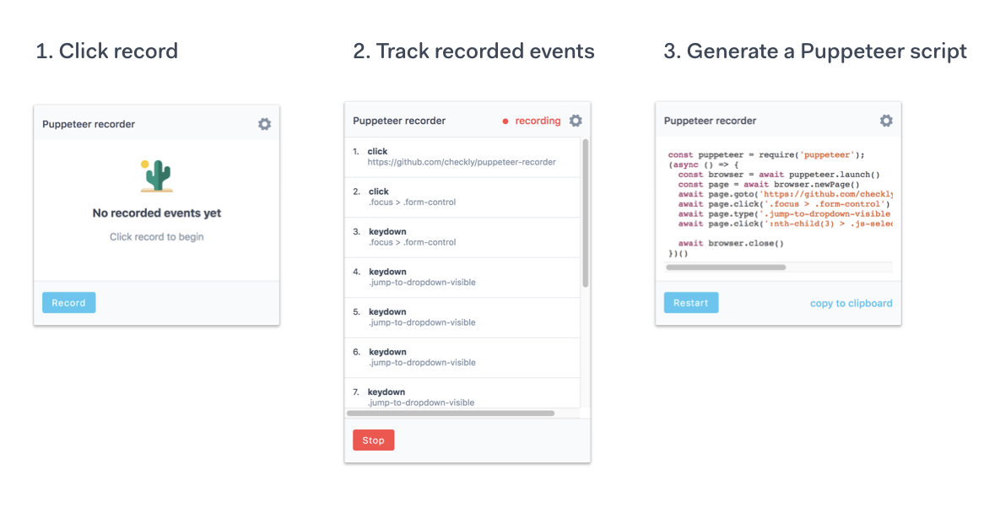

---

# puppeteer 关键API

[ puppeteer中文API文档 ](https://zhaoqize.github.io/puppeteer-api-zh_CN/#/)

## 一、init
```javascript
const puppeteer = require('puppeteer');
const brower = puppeteer.lunch();
const page = brower.newPage();
// some code here...
brower.close();//释放内存
```

## 二、page

### 1.setRequestInterception(value)

#### 1.1 请求拦截器

启用请求拦截器，会激活 `request.abort`, `request.continue` 和 `request.respond` 方法。这提供了修改页面发出的网络请求的功能。

```javascript
const puppeteer = require('puppeteer');

puppeteer.launch().then(async browser => {
  const page = await browser.newPage();
  await page.setRequestInterception(true);
  page.on('request', interceptedRequest => {
    if (interceptedRequest.url().endsWith('.png') || interceptedRequest.url().endsWith('.jpg'))
      interceptedRequest.abort();
    else
      interceptedRequest.continue();
  });
  await page.goto('https://example.com');
  await browser.close();
});
```

#### 1.2 请求拦截例2

```js
'use strict';
 
const puppeteer = require('puppeteer');
(async () => {
    try {
        const browser = await puppeteer.launch({
            ignoreHTTPSErrors: true,
            headless: false,
            args: ['--no-sandbox', '--disable-setuid-sandbox'],
        }).catch(() => browser.close);
        const page = await browser.newPage();
        await page.setRequestInterception(true);
        var num = 0;
        await page.on('request', request => {
            //这就是请求的类型如果是图片类型的话执行abort拦截操作 否则continue继续请求别的
            if (request.resourceType() === 'image') {
                console.log(num + "image: ");
                let res = request.response();
                console.log(request.url);
                console.log(res);
                num++;
                request.abort();
            } else {
                // request.respond({
                //     status: 200,
                //     contentType: 'text/plain',
                //     body: 'GOOD!'
                // });
                console.log("continue")
                request.continue();
            }
 
        });
        // page.on('request', request => {
        //     if (request.resourceType() === 'image')
        //         request.abort();
        //     else
        //         request.continue();
        // });
        await page.goto('https://news.google.com/news/');
        await page.screenshot({path: 'news.png', fullPage: true});
 
        await browser.close();
    } catch (e) {
        console.log(e);
    }
 
})();
```

#### 1.3 拦截Api的response

```js
/**
 * 获取拦截某条url内容的
 * @param page
 * @returns {Promise<any | never>}
 */
async function getResponseMsg(page) {
    return new Promise((resolve, reject) => {
        page.on('request', request => {
            if (request.url() === 'https://test.do') {
                console.log(request.url());
                console.log("拦截到了这条url然后就该请求了");
                page.on('response', response => {
                    if (response.url() === 'https://test.do') {
                        const req = response.request();
                        console.log("Response 的:" + req.method, response.status, req.url);
                        let message = response.text();
                        message.then(function (result1) {
                            results = result1;
                            resolve(results);
                        });
                    }
 
                });
                request.continue();
 
            }
            else {
                console.log(request.url());
                console.log("continue");
                request.continue();
            }
 
        });
    }).catch(new Function()).then();
 
}
```

### 2. 页面加载状态判断

我们首先要先把页面加载出来，然后才能做截图处理。但是加载页面，如何判断页面加载完毕呢？puppeteer 在打开页面时有提供 waitUntil 选项以及 timeout 时长，这里取值可以是下列四个选项之一：

```js
const maxTimeout: number;
const url: string;

const gotoAction = () => {
    return page.goto(url, {
        waitUntil: waitUntil as 'networkidle0' | 'networkidle2' | 						   'domcontentloaded' | 'load',
        timeout: maxTimeout,
    });
};
```

通过一个 Promise 简单包装下打开页面时可能出现的报错，我们的代码可以写成下面这样：

```js
let pageErrorPromise = new Promise((_res, rej) => {
    promiseReject = rej;
});

page.on('pageerror', (pageerr) => {
    //监听页面报错
    promiseReject(pageerr);
});

await Promise.race([
    gotoAction(),
    pageErrorPromise,
]);
```

> 即便到这一步，你依旧可能没法确认页面已经加载完毕，**假设页面就是存在一段特殊逻辑需要在5s后进行一个公式渲染**。

 puppeteer 提供有**监听页面变量/方法变动**的 API [ page.waitForFunction  ](https://zhaoqize.github.io/puppeteer-api-zh_CN/#?product=Puppeteer&version=v10.0.0&show=api-pagewaitforfunctionpagefunction-options-args)，于是我们可以这么做：

```js
await page.waitForFunction('window.allDone', {
    timeout: maxTimeout,
});
```

### 3.网页截图遇到分页，处理临界点问题

#### 3.1 第一步 **等待所有 DOM 节点加载完成**

由于页面中大多数资源除了文本便是图片资源，而图片资源还可能会通过动态逻辑生成，为了准确计算各个节点的尺寸大小与重排，我们需要等待节点加载并完成渲染后再做进一步操作，这里采用监听 [load](https://developer.mozilla.org/en-US/docs/Web/API/Window/load_event) 事件（load 事件已经包含样式文件以及图片资源的加载判断，但针对 JavaScript 逻辑中动态生成的图片标签可能捕获不准）加额外一次 img 标签 complete 状态轮询的方式确定内容渲染完成。

```js
// load 事件监听
window.onload = (event) => {
  console.log('page is fully loaded');
};

// img 标签加载状态轮询（在 load 事件触发后执行）
const imgs = document.querySelectorAll('img');

imgs.map((img) => {
	if (img.complete) {
		// ...
	} else {
		// ...
	}
});
```

#### 3.2 第二步 **打平 DOM 树**

因为要确保分页的准确，所以我们肯定需要对整个 DOM 进行递归性遍历，挨个枚举判断其在文档流中的位置与尺寸，所以我们先将目标节点全部打平。这里相对比较简单，用个 DFS 将 DOM 元素递归打平即可，可能有时我们需要跳过一些指定元素的递归，那么额外维护一个列表即可。

```js
// 节点列表
const elementList = [];

// 自定义跳过的节点与 className 列表
const CUSTOM_CLASS_AND_TAGS = ['header', 'footer', 'custom-pagination'];

// 获取节点
const getNode = (id: string): HTMLElement => {
    return document.getElementById(id);
}

//
const dfs = (node: HTMLElement): void => {
    // 注释节点则跳过
    if (node.nodeType === Node.COMMENT_NODE) {
        return ;
    }

    if (node.nodeType === Node.TEXT_NODE) {
        elementList.push(node);
        return ;
    }
		
    // 通过该方法可以获得节点的 className 以及 tag
    const nodeClassAndTag = getNodeClassAndTag(node);
    const isLeafNode = CUSTOM_CLASS_AND_TAGS.some(leafNodeSelector =>
        nodeClassAndTag.includes(leafNodeSelector)
    );

    if (isLeafNode) {
        elementList.push(node);
        return ;
    }

    node?.childNodes?.forEach(item => dfs(item));
}
```

#### 3.3 第三步 **找到跨越边界的节点**

这一步的解法也很直观，借助上一步产出的节点列表，我们可以利用二分来快速定位边界节点，但如何确定节点是否越界呢？这里需要借助 Web API 中的 Range 对象，Range 对象是表示一个包含节点与文本节点的一部分的文档片段。

利用 [Document.createRange()](https://developer.mozilla.org/en-US/docs/Web/API/Document/createRange) 可以产生一个 Range，在这个对象上调用 `getBoundingClientRect()` 可以得到一个 DOMRect 对象，该对象将范围中的内容包围起来，你可以理解成这是一个边界矩形，通过他你便可以算出当前内容是否超过一页。

```js
// 产生 Range
const range = document.createRange();
range.selectNodeContents(getNode('id'));

// 二分查找
const startIndex = 0;
const endIndex = elementList.length - 1;

while (startNodeIndex < endNodeIndex) {
    const midNodeIndex = Math.floor((startNodeIndex + endNodeIndex) / 2);
    const node = elementList[midNodeIndex];
    const includeInNewPage = includeInNewPage(node);
    if (includeInNewPage) {
        startNodeIndex = midNodeIndex + 1;
    } else {
        endNodeIndex = midNodeIndex;
    }
}

// 判断包含节点的 Range 是否越界
const includeInNewPage = (el: HTMLElement) => {
    const innerRange = range.cloneRange();
    innerRange.setEndAfter(el);

    const rect = innerRange.getBoundingClientRect();

    // 判断逻辑
    // rect.height ... 
}
```

#### 3.4 第四步 **将内容切分为当前页与剩余内容**

虽然我们找到了越界的节点，但是我们并不清楚它是从哪开始越界的。

打个比方，当前节点是一段三行的文本，可能到第二行末尾都是放的下的，只有到第三行才越界，那么我们在切分时就该准确的找到这个位置，并把原来的 DOM 切成两半。再比如，如果我们所遇到的节点是非文本节点，那么这个节点便可以认为是不可再分的单元，只能被唯一分到其中一半中去，所以这块的伪代码应该长成这样：

```js
const newPagedContentRange: Range;
const remainedContentRange: Range;

const paging = (boundaryNodeIndex: number) => {
    const boundaryNode = elementList[boundaryNodeIndex];

    if (boundaryNode.nodeType === Node.TEXT_NODE) {
        const boundaryCharIndex = binarySearchBoundaryCharIndex(boundaryNode);

        newPagedContentRange.setEnd(boundaryNode, boundaryCharIndex);
        remainedContentRange.setStart(boundaryNode, boundaryCharIndex);

        return;
    }

    newPagedContentRange.setEndBefore(boundaryNode);
    remainedContentRange.setStartBefore(boundaryNode);

    // 判断 newPagedContentRange 是不是真的有内容，避免无限循环
    const rect = newPagedContentRange.getBoundingClientRect();

    if (!rect.height) {
        newPagedContentRange.setEndAfter(boundaryNode);
        remainedContentRange.setStartAfter(boundaryNode);
    }
}
```

上面有一个方法没有展开，即 `binarySearchBoundaryCharIndex`，它的作用是采用二分对当前文本节点进行切分，并返回越界的文本位置下标，这里在判断时依然是采用复制 Range 然后判断边界矩形的思路，只不过 [Range.setEndAfter()](https://developer.mozilla.org/en-US/docs/Web/API/Range/setEndAfter) API 要换成 [Range.setEnd()](https://developer.mozilla.org/en-US/docs/Web/API/Range/setEnd)，因为这里你要对一个节点中的文本依次遍历。完成判断之后，便可以拿到 `newPagedContentRange` 对当前页内容进行操作/复原。

**另外，对 remainedContentRange 循环如上第三步和第四步，直至剩余内容不再超过一页。**

### 4.插件与其他

#### 4.1 puppeteer-recorder



### 5.focus（selector）

要给焦点的元素的选择器[selector](https://developer.mozilla.org/en-US/docs/Web/CSS/CSS_Selectors)。如果有多个匹配的元素，焦点给第一个元素。

### 6.page.hover(selector)

要hover的元素的选择器。如果有多个匹配的元素，hover第一个。

